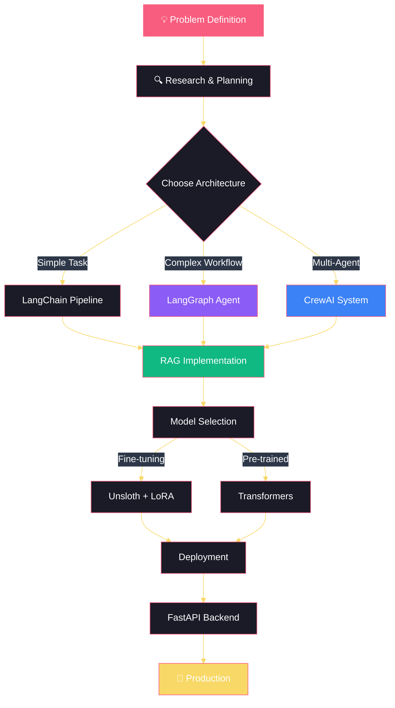

<div align="center">

# 👋 Hi, I'm Md. Abdur Rahman


<p align="center">
  <a href="https://mdabdurrahmanportfolio.vercel.app" target="_blank">
    
  </a>
  <a href="https://linkedin.com/in/md-abdurrahman770" target="_blank">
    
  </a>
  <a href="https://github.com/Arprovat" target="_blank">
    
  </a>
  <a href="mailto:provatar0@gmail.com">
    
  </a>
</p>


</div>

---

## 🚀 About Me


```python
class AIEngineer:
    def __init__(self):
        self.name = "Md. Abdur Rahman"
        self.role = "AI Developer @ SM Technology"
        self.location = "Dhaka, Bangladesh 🇧🇩"
        self.education = "B.Sc. in CSE @ Green University"
        self.portfolio = "mdabdurrahmanportfolio.vercel.app"
        
        self.current_focus = [
            "🤖 RAG Systems & Retrieval",
            "🧠 LLM Applications",
            "🔄 Agentic Workflows",
            "🗣️ Multimodal AI"
        ]
        
        self.specialties = {
            "AI/ML": ["LangChain", "LangGraph", "CrewAI"],
            "NLP": ["Transformers", "Unsloth", "RAG"],
            "Full Stack": ["React", "Node.js", "FastAPI"]
        }
        
    def say_hi(self):
        print("Thanks for dropping by!")
        print("Let's build something amazing together! 🚀")

me = AIEngineer()
me.say_hi()
```

<br clear="right"/>

🔭 **Currently:** Building AI-powered education & travel platforms at **SM Technology**  
🌱 **Learning:** Advanced agentic workflows with **LangGraph** & **CrewAI**  
💡 **Passionate about:** NLP, RAG systems, and intelligent conversational AI  
🎯 **2025 Goals:** Contribute to open-source AI projects & build production-grade LLM apps  
📫 **Reach me:** provatar0@gmail.com | [Portfolio](https://mdabdurrahmanportfolio.vercel.app)

---

## 💼 Professional Journey

<table>
<tr>
<td width="50%" valign="top">

### 🏢 SM Technology
**AI Developer** | *Nov 2025 - Present*

```yaml
Achievements:
  - 🎓 AI Education Platform (RAG-based)
  - ✈️ Multimodal Travel Chatbot
  - 🎯 Automated Lesson Generation
  - 🔄 Real-time API Integration
  - 📈 Enhanced User Engagement +40%
```

**Tech Stack:** Python • LangChain • RAG • FastAPI

</td>
<td width="50%" valign="top">

### 🎓 Education
**Green University of Bangladesh**  
*B.Sc. in Computer Science & Engineering*  
📅 Jan 2022 - Present

```yaml
Focus Areas:
  - 🤖 Artificial Intelligence
  - 🧠 Deep Learning & NLP
  - 💻 Software Engineering
  - 🔬 Research & Innovation
```

</td>
</tr>
</table>

---

## 🛠️ Tech Arsenal

<div align="center">

### 💻 Languages


### 🤖 AI/ML & Agentic Frameworks


### 🎨 Frontend Development


### ⚙️ Backend & APIs


### 🗄️ Databases


### 🔧 Tools & Platforms


</div>

---

## 🎯 Featured Projects

<div align="center">

<table>
<tr>
<td width="50%" valign="top">

<h3 align="center">⚖️ Lawyer.AI Chatbot</h3>
<div align="center">
  
  
  
  
</div>

```yaml
Features:
  ✓ LangGraph workflow orchestration
  ✓ Hybrid RAG (dense + sparse)
  ✓ Cross-encoder reranking
  ✓ Citation-aware responses
  ✓ Multi-turn conversations
```

</td>
<td width="50%" valign="top">

<h3 align="center">💰 Expense Tracker (MCP)</h3>
<div align="center">
  
  
  
</div>

```yaml
Features:
  ✓ Natural language interface
  ✓ Multi-user support
  ✓ Real-time tracking
  ✓ Conversational finance mgmt
```

</td>
</tr>

<tr>
<td width="50%" valign="top">

<h3 align="center">📚 EduConnect Platform</h3>
<div align="center">
  
  
  
  
</div>

```yaml
Features:
  ✓ Geolocation-based search
  ✓ Real-time notifications
  ✓ JWT authentication
  ✓ Dark/Light theme
  ✓ Google Maps integration
```

</td>
<td width="50%" valign="top">

<h3 align="center">🗣️ Bangla Hate Speech Classifier</h3>
<div align="center">
  
  
  
  
</div>

```yaml
Features:
  ✓ Fine-tuned BanglaBERT
  ✓ LoRA/QLoRA optimization
  ✓ 72% accuracy achieved
  ✓ Multi-class detection
```

</td>
</tr>

<tr>
<td width="50%" valign="top">

<h3 align="center">💬 AI-Enhanced Chat App</h3>
<div align="center">
  
  
  
  
</div>

```yaml
Features:
  ✓ Google Gemini AI integration
  ✓ Real-time WebSocket messaging
  ✓ Presence indicators
  ✓ Shareable transcripts
```

</td>
<td width="50%" valign="top">

<h3 align="center">🔍 AI Search Agent</h3>
<div align="center">
  
  
  
</div>

```yaml
Features:
  ✓ Multi-session memory
  ✓ Web search integration
  ✓ Conversational interface
  ✓ Context-aware responses
```

</td>
</tr>
</table>

</div>

---

## 📊 GitHub Analytics

<div align="center">


</div>

<div align="center">
  
  
</div>

<details>
<summary>📈 More GitHub Metrics</summary>
<br>

<div align="center">


</div>

<div align="center">

| 🎯 Total Contributions | ⭐ Total Stars | 🔱 Total Forks | 📦 Total Repos |
|:---:|:---:|:---:|:---:|
|  |  |  |  |

</div>

</details>

---

## 🏆 Achievements & Certifications

<div align="center">

<table>
<tr>
<td align="center" width="33%">

### 🎯 Problem Solving
```
100+ LeetCode Problems
Algorithmic Optimization
Data Structures Master
```
[](https://leetcode.com/Arprovat)

</td>
<td align="center" width="33%">

### 🏅 Competitions
```
Top: BLP Workshop
Winner: BUBT AI Conquest
University Leadership
```


</td>
<td align="center" width="33%">

### 📚 Methodologies
```
Agile Development
Team Leadership
Project Management
```


</td>
</tr>
</table>


</div>

---

## 💡 AI Development Workflow



---

## 🌐 Languages & Communication

<div align="center">

| Language | Proficiency | Usage |
|:--------:|:-----------:|:-----:|
| 🇧🇩 **Bengali** | Native | ████████████ 100% |
| 🇬🇧 **English** | Fluent | ███████░░░░░ 80% |
| 🇮🇳 **Hindi** | Fluent | █████████░░░░░ 85% |

</div>

---

## 📈 Coding Activity

<div align="center">

<!--START_SECTION:waka-->
```text
Python       12 hrs 45 mins  ████████████░░░░░░░░░  58.2%
JavaScript    4 hrs 18 mins  ████░░░░░░░░░░░░░░░░░  19.7%
React         2 hrs 35 mins  ██░░░░░░░░░░░░░░░░░░░  11.8%
SQL           1 hr 12 mins   █░░░░░░░░░░░░░░░░░░░░   5.5%
Other         1 hr 5 mins    ░░░░░░░░░░░░░░░░░░░░░   4.8%
```
<!--END_SECTION:waka-->

</div>

---

## 🎨 Skills Proficiency

<div align="center">

| Skill Category | Technologies | Proficiency |
|:--------------|:-------------|:------------|
| 🤖 **AI/ML** | LangChain • LangGraph • CrewAI • Transformers |  |
| 🔄 **RAG Systems** | Vector DBs • Embeddings • Retrieval |  |
| 🧠 **NLP** | Unsloth • LoRA • PEFT • HuggingFace |  |
| ⚛️ **Frontend** | React • Redux • Tailwind CSS |  |
| 🔧 **Backend** | Node.js • FastAPI • Express |  |
| 🗄️ **Databases** | MongoDB • PostgreSQL • MySQL |  |

</div>

---

## 🔥 Current Focus Areas

<div align="center">

```ascii
╔════════════════════════════════════════════════════════════╗
║                                                            ║
║   🎯  Building Production-Grade LLM Applications          ║
║   🤖  Mastering Agentic AI with LangGraph & CrewAI        ║
║   🔄  Advanced RAG Architectures & Optimization           ║
║   ⚡  Fine-tuning with Unsloth for Efficient Inference    ║
║   🌐  Full-Stack AI Integration & Deployment              ║
║                                                            ║
╚════════════════════════════════════════════════════════════╝
```

</div>

---

## 🤝 Let's Build Something Amazing!

<div align="center">


### 💬 I'm Always Open To:

🚀 **Collaborating** on innovative AI projects  
🤝 **Contributing** to open-source initiatives  
💡 **Discussing** RAG systems, LLMs, and agentic AI  
🎓 **Sharing** knowledge about NLP and transformers  
☕ **Having** a tech chat over virtual coffee

<br>

### 📫 Connect With Me:

<a href="https://mdabdurrahmanportfolio.vercel.app" target="_blank">
  
</a>
<a href="https://linkedin.com/in/md-abdurrahman770" target="_blank">
  
</a>
<a href="mailto:provatar0@gmail.com">
  
</a>
<a href="https://github.com/Arprovat" target="_blank">
  
</a>

<br><br>

### ✨ Quote of the Day


<br>

---


---

**⭐ If you find my work interesting, please consider giving it a star!**

<sub>Made with ❤️ by Md. Abdur Rahman</sub>

</div>
